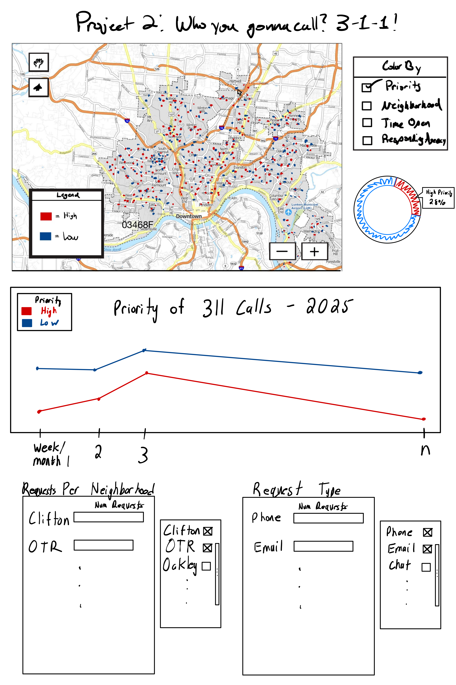

# who-you-gonna-call
Project code for CS5124 - Project 2: Who you gonna call? 3-1-1!

## Motivation 
To help people quickly understand where, when, and what kinds of 311 issues are happening in Cincinnati, using linked map + timeline + attribute views so they can explore patterns (hotspots, seasonality, and which departments/priorities are involved) instead of scanning raw records.

## Data 

This project uses 2025 Cincinnati 311 non-emergency service request data. 

- Official dataset: [Cincinnati 311 Non-Emergency Service Requests](https://data.cincinnati-oh.gov/Thriving-Healthy-Neighborhoods/Cincinnati-311-Non-Emergency-Service-Requests/4cjh-bm8b) 

- Repository CSV used by the app: [data/Cincinnati_311_(Non-Emergency)_Service_Requests_20260227.csv](https://github.com/mattheeter/who-you-gonna-call/blob/dev/data/Cincinnati_311_(Non-Emergency)_Service_Requests_20260227.csv) 

- Base Cincinnati neighborhood GeoJSON source: [blackmad/neighborhoods repository search for Cincinnati](https://github.com/search?q=repo%3Ablackmad%2Fneighborhoods%20cincinnati&type=code) 

- Neighborhood boundary file used on the map: [data/cincinnati.geojson](https://github.com/mattheeter/who-you-gonna-call/blob/dev/data/cincinnati.geojson), which is a customized version of that base source with East Walnut Hills added 

Our site filters the raw Cincinnati 311 Non-Emergency Service Requests CSV down to 14 service types that are mappable and comparable in a single interface. Important fields used in the visualization include request type, neighborhood, public agency, priority, method received, creation date, last update date, latitude, and longitude. In the app, `DATE_CREATED` drives the timeline, `DATE_LAST_UPDATE` is used to derive response-time measure in days, and latitude/longitude put each request on the map. 

One important design decision is that the app does not attempt to visualize every possible field from the dataset at once. It focuses on fields that can be compared across multiple views such as geography, time, service category, agency, priority, and request intake method. 

## Sketches 

We started our project by creating the sketch shown above as a reference for us to begin building and laying out our visualizations. We found sketching to be crucial in our ability to work asynchronously on the project as it enabled us to work individually while ensuring we were working towards our shared vision. With visually creative projects such as this one, making design decisions can be very difficult but using sketches to explain our thoughts helped us communicate our ideas effectively. 

The main part of the sketch is how we wanted to size and layout the map. We all agreed that it should be the first thing users see and interact with, because it is the best way to convey the geospatial insights of the 311 data. Below the map, we wanted to add something which showed the same data as above but on a time scale to supplement what is shown above. In our final product, we coupled the plot below to the map with an animation to better show the changes in 311 calls over time. 

While the sketches were a great starting point, you will see that our final project has taken some large deviations. We were able to bake in certain features like the panning and zooming more natively, and were able to consolidate the legend and color by selections into one control box saving space on the screen. We found that a lot of the supplemental visualizations would work well by themselves without having to be on the screen at the same time as the map. We then decided to remove them from the side and put them below the map to make more space. 

## Vis components 

### CMV Dashboard: 311 Calls Visualization
The app is a coordinated multiple-views (CMV) dashboard with six linked views:

#### Views

Map (Leaflet): plots calls by lattitude/longitude with a heat layer and boundary overlay. Supports service type filtering, legend-based color encoding, and rectangle brushing by SR_NUMBER.

Timeline: weekly bar chart of call volume. Supports hover tooltips, x-axis brush (filters all views), and a Play/Pause animation that sweeps through all calls in the year in ~30 seconds.

4 Attribute Charts (horizontal bar charts): Neighborhood, Method Received, Agency, and Priority. Each supports hover tooltips and y-axis brushing to filter all other views.

Interactions are fully linked — brushing any view (map, timeline, or attribute chart) filters all others. Reset clears all selections.

## Discovery 

Spatial hotspots shift by service type — toggling categories moves density clusters across the city.
Eg: Overtime parking requests cluster in Clifton/Downtown Cincinnati as seen below: 

Seasonal patterns — some categories (e.g., snow/ice/trash pickups) spike in winter; others are uniform. Almost all of slippery streets requests were made in January. 

## Process 

### Libraries

We used only a handful of libraries to build our application. The main library we relied on, [D3](https://d3js.org/), 
enables creation of and brushing, linking, animating, and providing on-demand details within the various charts we display. All charts utilize D3 to produce their SVG elements, position them in the right location, and add the necessary event handlers to provide hover and brushing interactions. The map is made with [Leaflet](https://leafletjs.com/). Leaflet has built-in functionality for producing tiles of street or satellite-based geospatial information, and an interface for adding various elements such as markers and the heatmap, and interactions like brushing, panning, and zooming. For the heatmap specifically, a library called [Leaflet.heat](https://github.com/Leaflet/Leaflet.heat) was used. This took in the same latitude/longitude pairs as the markers and drew on the map based on the density of the data. 

### Structure

As for code structure, we settled on a pretty flat layout. Two modules comprise the project: one for attribute/timeline views and one for the map. The attribute and timeline view code is pretty strictly D3-derived, thus it logically gets grouped together. The map module more heavily relies on Leaflet, thus it is on its own. This module also contains logic for data parsing and more general filter operations (such as that for service types). It's located in the map module because the map requires tighter coupling to the data (more controls and attributes are required) whereas the other module has more flexibility with their data interface and can adapt to what the map might need.

### Code and App
To run our code, pull it down from [here](https://github.com/mattheeter/who-you-gonna-call/tree/1.0.2) and serve it using your choice of framework. Our deployed application lives [here](https://who-you-gonna-call-five.vercel.app/).

## Challenges/Future Work 

We had a few challenges that we faced along the way in creating our project. No one in our group is particularly privy to CSS, thus styling was a challenge. There was stuff with the way classes vs. IDs are defined that we got hung up on and it took awhile to find a way to standardize our tooltip styling. We also struggled with map interactions once the heatmap was added. The heatmap seemingly was placed in front of what the map uses for interacting with the markers. Having it so that the heatmap layer was added prior to the marker layer made it so that on initial load interactivity was restored, but any filtering messed it back up. The solution was to not re-create the heatmap layer with every change but rather to update the layer that was already there. 

One nice-to-have that could be addressed in the future is sharing relevant attributes between visualizations. A concrete example of this is with the attribute views. Our map uses one color scheme to differentiate between neighborhoods, e.g., but the corresponding view of call counts does not adopt this scheme, creating a little bit of a disconnect.

## AI and Collaboration 

Soham - I used Cursor to help me write the documentation for this project as well as helping me with the animating the timeline for the Level 8 goal. I also used Claude Code for some debugging as I find it better with debugging single files as Cursor can get confused with the project context sometimes. 

Matt -  I tried to use ChatGPT to help debug the heatmap problems. After going back and forth for awhile, I was receiving lots of recommendations to fix the way things were seprated into panes (with the goal of getting the interactivity pane in the front). This never quite worked how we wanted, and it was Gemini's idea to add the heatmap layer once (instead of every update) and update it with the new point information. I'm a ittle disappointed I couldn't get this far with ChatGPT, especially given that it was the automatic Google search Gemini response that helped me get through the problem.

Austin -  I used Cursor to help with UI layouts, specifically when laying out the map with the charts and timelines and dealing with CSS to get the styles I was wanting to achieve. It also helped to add East Walnut Hills to our neighborhood outline geojson, because it was originally missing from the dataset. In addition to UI, Cursor was helpful for debugging and providing useful snippets for filtering and coloring the points on the map.

JP -  I found that AI was really useful to add new `Color by` options once the styling was already determined for at least one other option and the controller object had already been made. Using the built-in Copilot in VSC, I was able to quickly implement the `Service Types` option to the legend without having to manually create each individual portion. 

I was able to use comments in the text editor as well as the chat feature to provide the context of the other implemented options. Copilot was able to use thes to model the new feature after the previous ones, matching the formatting, styling, and features supported in the other options. The output was not fully implemented and didn't create any of the new logic which makes `Service Types` different, but it did save me a lot of time and let me focus on implementing the nuances like how to change the rows of data being plotted, and toggle which points are visible and which are not using the legend.

## Attribution 

Austin worked on the base map and getting the data plotted onto the map of Cincinnati and implementing both street and aerial way. He also helped with UI decisions for the overall view of the page.  

Matt developed the heatmap functionalities and attribute views for the four different attributes Neighbordhood, Public Agency, Priority and Method of Call  

Soham implemented the timeline viewer for calls throughout the year as well as the animation that shows changes in call volume over the year. He also implemented the linking for brushing between the map and attribute/timeline graphs.  

JP implemented the various Service Types for the 311 calls and the ability to select them on the map and update the other charts based on the selection.  

## Demo

A demonstration of our video can be found [here](https://youtu.be/GZ52v-P_riE).
